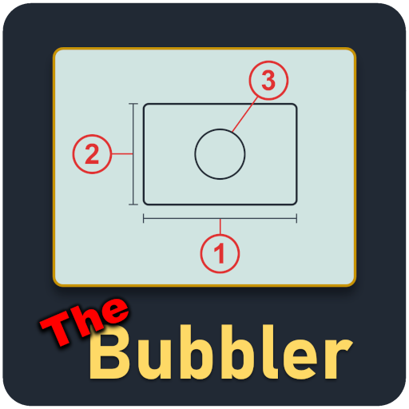
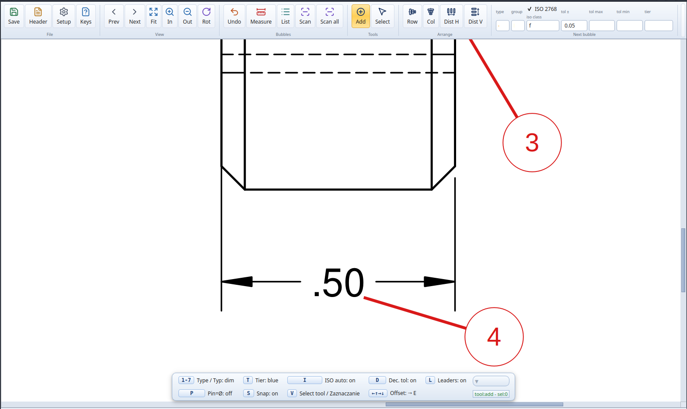

# Bubbler

## Description

Balloon a PDF print, classify callouts, and fill inspection sheets. 
Free, open source, fully offline.

## Features

- TBD

## Requirements

- Linux, Windows, or macOS. Prebuilt binaries need no Python.
- From source: Python 3.10 to 3.12.

## Installation

Download the binary for your OS from [Releases](https://github.com/InPoint-Automation/The-Bubbler/releases). No Python needed.
- Windows: run `Bubbler.exe`
- Linux: `chmod +x Bubbler-x86_64.AppImage && ./Bubbler-x86_64.AppImage` (may need `libfuse2`)
- macOS: open `Bubbler.app` (unsigned, right-click then Open)

From source: see [DEV.md](DEV.md).

## Usage

Open a drawing, click to place bubbles. First bubble runs OCR and can hang for a couple seconds.
You can measure in the program or just Save which exports the ballooned PDF and `.xlsx` sheet 
(either with measurements or you can manually do the measurements).

## Contributing

Feel free to fork this project or contribute a PR.
Build and Windows packaging instructions are in the developer readme [DEV.md](DEV.md).

## Licenses

### Main code

This project is licensed under the GPLv3+

See [LICENSE](LICENSE) file for details.

### Third-Party Components

Full license texts for all bundled and depended-on components are in the
[Third Party Licenses](Third%20Party%20Licenses/) directory.

Bundled assets:

- [Lucide](https://github.com/lucide-icons/lucide) - ISC License (portions derived from [Feather](https://github.com/feathericons/feather), MIT) - Toolbar and ribbon icons, recolored at runtime into Qt icons
- [Florence-2-base-ft](https://huggingface.co/onnx-community/Florence-2-base-ft) - MIT License - Optional VLM callout reader (model weights)
- [PaddleOCR-VL / PP-OCRv4](https://github.com/PaddlePaddle/PaddleOCR) - Apache-2.0 License - Optional VLM/OCR callout readers (model weights)

Runtime dependencies (installed via `pip`, compiled into the binaries by Nuitka):

- [PyMuPDF](https://github.com/pymupdf/PyMuPDF) - AGPL-3.0 License (or commercial from Artifex) - PDF parsing, rendering, and text/word-box extraction
- [PySide6 (Qt for Python)](https://www.qt.io/qt-for-python) - LGPL-3.0 License - GUI framework. Qt ships several licenses [Third Party Licenses/pyside6](Third%20Party%20Licenses/pyside6/)
- [openpyxl](https://foss.heptapod.net/openpyxl/openpyxl) - MIT License - Reading and writing the `.xlsx` inspection sheet
- [NumPy](https://github.com/numpy/numpy) - BSD-3-Clause License - Array and numerical operations
- [ONNX Runtime](https://github.com/microsoft/onnxruntime) - MIT License - Runs the detector and reader `.onnx` models (CUDA / DirectML / CPU execution providers)
- [RapidOCR](https://github.com/RapidAI/RapidOCR) - Apache-2.0 License - OCR engine (ships its own ONNX models)
- [PaddleOCR](https://github.com/PaddlePaddle/PaddleOCR) - Apache-2.0 License - PP-OCRv4 OCR engine and PaddleOCR-VL reader
- [PaddlePaddle](https://github.com/PaddlePaddle/Paddle) - Apache-2.0 License - Runtime backing the PaddleOCR readers
- [tokenizers](https://github.com/huggingface/tokenizers) - Apache-2.0 License - Tokenizer for the Florence-2 reader

Training also uses
[Ultralytics](https://github.com/ultralytics/ultralytics) (AGPL-3.0),
[PyTorch](https://github.com/pytorch/pytorch) (BSD-3-Clause), `onnx`, `onnxsim`,
and `pillow`.

The detector models shipped under `bubbler/models/` (`gdt_symbols.onnx`,
`gdt_regions.onnx`) are trained by InPoint Automation and released under the
project's GPLv3+.

## Credits

This project was developed by InPoint Automation Sp. z o.o.
https://inpointautomation.com/

## Changelog

See [CHANGELOG.md](CHANGELOG.md) for the full version history.
